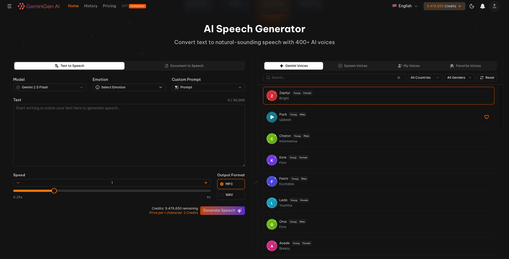

# AI Voice Generator API - TTS

AI Voice Generator API — Gemini TTS by Google.
Create natural, human-like voices with Gemini TTS at . Features include text-to-speech, multilingual voice support and studio-quality audio generation — with expressive tones for developers and creators. 👉 <a href="https://geminigen.ai/pricing" target="_blank">Check Pricing</a>.

> [!NOTE]  
> If you want a full editor, consider [GeminiGen AI Voice Generator](https://geminigen.ai/app/speech-gen) - a web app makes video creation and editing effortless, with powerful AI options, intuitive tools, and a clean, user-friendly interface designed for everyone. Along with <a href="https://ainnate-geminigen.github.io/GEMINIGEN.AI-API-DEMO/" target="_blank">a dedicated platform</a> that lets users with API access generate text to speech effortlessly.  

## ✨ Features  

Gemini TTS is Google’s most advanced and versatile text-to-speech model.
It enables you to generate and customize natural, human-like voices seamlessly through simple input, blending studio-quality audio with expressive flexibility.

With this state-of-the-art model at the core, our app unlocks a suite of powerful tools designed to make audio production effortless and inspiring:

- **🎙️ Two Powerful Models** — Choose between **Gemini 2.5 Flash** (fast & efficient) and **Gemini 2.5 Pro** (higher quality, expressive voices).  
- **📝 Text & Document to Speech** — Instantly convert text or full documents into natural-sounding audio.  
- **💬 AI Dialogue Generation** — Build multi-speaker conversations by adding multiple dialogue blocks, each assigned to a different voice. Perfect for creating roleplays, interviews, podcasts, or dramatized storytelling.  
- **🔊 Multiple Voice Sources** — Use **Gemini Voices** (AI voices), **System Voices** (native device voices), or even **Your Own Custom Voices**.  
- **🎭 Custom Prompt Control** — Go beyond presets and define your own **custom vocal instructions** (e.g., *soft whisper, news anchor style, bedtime story tone*) to fine-tune the output exactly as you need.  
- **😊 Emotion & Style Control** — Select from presets (Casual, Excited, Firm, Informative, etc.) or define a **custom prompt** for fine-grained vocal expression.  
- **🌍 400+ AI Voices** — Wide variety of accents, tones, genders, and styles across different languages and countries.  
- **⚡ Speed Adjustment** — Fine-tune playback from **0.25x up to 4x** for perfect pacing.  
- **🎧 Multiple Output Formats** — Export to **MP3** or **WAV** for maximum compatibility.  
- **⭐ Voice Favorites & Management** — Save your own preferred voices and reuse them easily.  
- **📊 Real-Time Credit Cost Estimate** — See exactly how many credits your generation will use before you hit “Generate Speech”.  
- **🔗 Developer-Friendly API** — Simple endpoints to control model, emotion, text, speed, format, and voice selection.  

## 🎯 Usage Guide

### 🗣️ Text to Speech

1. **Choose Model** — Select between **Gemini 2.5 Flash** (fast, cost-efficient) or **Gemini 2.5 Pro** (expressive, high-quality).  
2. **Enter Text** — Type or paste up to **30,000 characters** into the text box.  
3. **Select Emotion & Style** — Pick from presets (Casual, Excited, Firm, Informative, etc.) or use a **Custom Prompt** for advanced tone control.  
4. **Pick a Voice** — Browse **Gemini Voices**, **System Voices**, or your **Saved Custom Voices**.  
5. **Adjust Speed** — Fine-tune playback speed from **0.25x** to **4x**.  
6. **Select Output Format** — Choose **MP3** or **WAV** for download.  
7. **Check Credits & Cost** — The UI displays cost per character. 
8. **Generate Speech** — Click **Generate Speech** to synthesize your audio. The file will be available for playback or download.  

### 📄 Document to Speech

1. **Choose Model** — Select **Gemini 2.5 Flash** or **Gemini 2.5 Pro** depending on your needs (speed vs. quality).  
2. **Upload Document** — Drag & drop or click to upload supported files: **DOCX, XLSX, PPTX, PDF, EPUB, MOBI, TXT, HTML, ODT, ODS, ODP, AZW, AZW3, ...**  
3. **Pick a Voice** — Choose from **Gemini Voices**, **System Voices**, or your **Saved Custom Voices**.  
4. **Adjust Speed** — Set reading pace from **0.25x** to **4x**.  
5. **Select Output Format** — Export the narration as **MP3** or **WAV**.  
6. **Check Credits & Cost** — The system shows exact credit usage before generating.  
7. **Generate Speech** — Hit **Generate Speech** and your document will be converted into high-quality spoken audio.  

### 💬 Dialogue TTS (Multi-Voice Conversations)

1. **Choose Model** — Pick between **Gemini 2.5 Flash** or **Gemini 2.5 Pro** depending on your use case.  
2. **Assign Voices** — Select **Voice 1**, **Voice 2** from the **Gemini Voices** list.  
3. **Add Dialogue Blocks** — Each block is tied to a specific voice (e.g., Voice 1, Voice 2).  
4. **Enter Dialogues** — Type the spoken lines for each voice in their respective blocks.  
5. **Customize Emotion & Style** — Apply presets or use a **Custom Prompt** (e.g., *whispering, news anchor style, bedtime storyteller*).  
6. **Adjust Speed** — Control playback pacing between **0.25x** and **4x**.  
7. **Select Output Format** — Export the conversation as **MP3** or **WAV**.  
8. **Check Credits & Cost** — Preview exact usage before generating.  
9. **Generate Dialogue** — Click **Generate** to create a multi-speaker audio simulating natural conversation.  

### 💡 Tips for Best Results

- ✍️ **Be clear with text**: Write clean, well-punctuated sentences for more natural speech.  
- 🎭 **Use emotions wisely**: Select an emotion (Casual, Excited, Firm, etc.) or a custom prompt to match the mood of your content.  
- 🌍 **Pick the right voice**: Choose voices that fit your audience’s language, accent, and gender preference.  
- ⚡ **Balance model choice**: Use **Gemini 2.5 Flash** for speed and cost savings, or **Gemini 2.5 Pro** for expressive, studio-quality narration.  
- 🎧 **Adjust speed**: Fine-tune playback speed (0.25x–4x) to suit audiobooks, learning materials, or fast demos.  
- 📄 **Leverage Document to Speech**: For long content (PDFs, DOCX, EPUB, etc.), upload documents directly instead of copy-pasting text.  

## 🔊 Results & Examples

See the power of AI **text-to-speech (TTS)** in action. Easily generate natural, expressive speech from any text with customizable voices, speeds, and emotions.  
We will take the example: **convert a short sentence into realistic speech**.

### 📄 Text/Document to speech
<image src="assets/images/geminigen_ai_tts_generator.png" controls width="100%"></image>

**Output audio:** [Listen to audio](assets/audios/tts_result_sample.mp3)

### 💬 Dialogue

<image src="assets/images/geminigen_ai_dialogue_generator.png" controls width="100%"></image>

**Output audio:** [Listen to audio](assets/audios/dialogue_result_sample.mp3)

## 🤝 Contributing

We warmly welcome contributions in the form of:

- 💡 **Feature Suggestions** — Share ideas to improve or expand the app’s capabilities.
- 🛠 **Enhancements** — Propose improvements to performance, UI/UX, or AI model usage.
- 🐞 **Bug Reports** — Help us identify and fix issues to ensure a smooth user experience.
- 📈 **Collaboration** — We are open to discussions about potential partnerships or integrations.

👉 If you’d like to contribute, please reach out via **Issues** or contact us directly at [contact@geminigen.ai](mailto:contact@geminigen.ai)

## 🔗 Links & Resources

- 👨‍💻 **Our website:** [https://geminigen.ai](https://geminigen.ai/)
- 📚 **Our API Documentation:** [https://docs.geminigen.ai](https://docs.geminigen.ai/)
